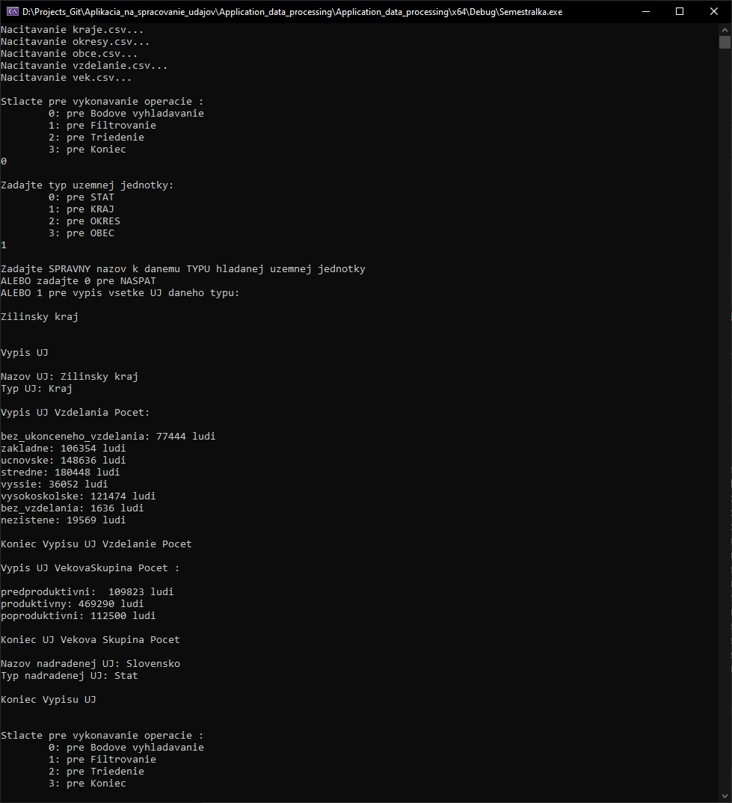
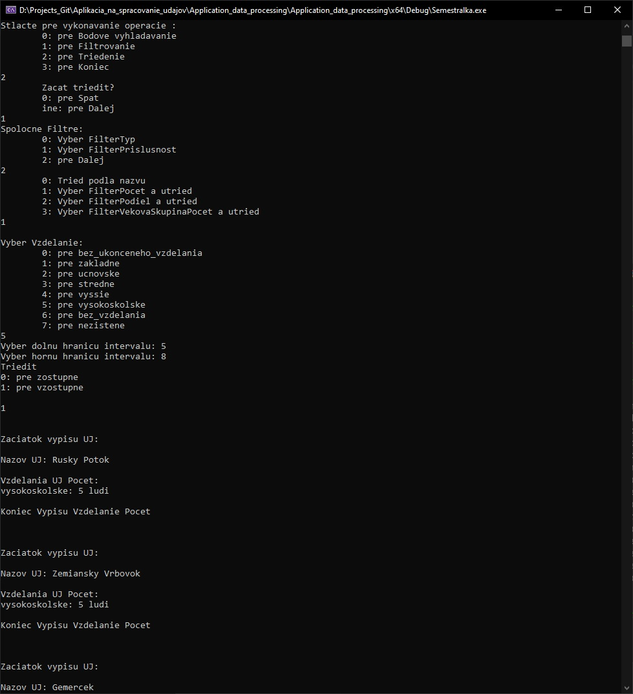

<h1>Application for the processing of data from the Census of Houses and Flats of the year</h1>

<h2>User manual</h2> 

After starting the program, the user waits for a short time for the data to be loaded and is informed of this. A list of operations from which the user can choose will then appear on the console. The program usually prompts the user for a numeric input to select the desired operation. Each operation must be confirmed with ENTER!

**Bodove vyhladavanie** asks for the type of territorial unit and then asks for the name of a certain territorial unit in the exact form, which is the official name of the territorial unit. The name must be valid for the type of territorial unit. Districts have the word 'District' before their official name. Counties have the word 'county' after their official name. So there is a difference, for example, between 'Žilina' and 'Okres Žilina' and 'Žilinský kraj'. The first specifies the municipality, the next the district and the last the county. Duplicities have an immediate superordinate unit added to their name. So if we have e.g. the municipality Píla, which has a duplicate, the user has to write without apostrophes and spaces 'Píla - Lučenec' , where Píla is the name of the municipality and Lučenec is the name of the higher territorial unit, i.e. the name of the county.

**Filtracia** the user first chooses whether or not to use filters. If not, all territorial units are listed sorted by their code. Their names, type and the names and types of the parent units of the given territorial unit are listed. If the user wants to use filters, he is prompted to choose whether he wants an AND or OR logical operation. For AND, this means that the territorial unit must satisfy all filters to be inserted into the filtered table. For OR, it is sufficient if it meets at least one filter. After selecting a logical operation, the user can choose from a list of filters to be applied. After that, it is enough to press and confirm button 7, for 'Do not select'. Then all the territorial units that match the filters will be listed, according to the selected logical operation.

**Triedenie** the user is asked to select first from the common filters and then further from the filters, with the criterion according to which they will be sorted. After filtering, the user is still prompted whether to sort the table ascending or descending. Then the territorial units are already listed on the console according to the selected parameters. The last operation is to exit the application, which when selected by the user exits the application.

**Needs MS Visual Studio to run**

  

